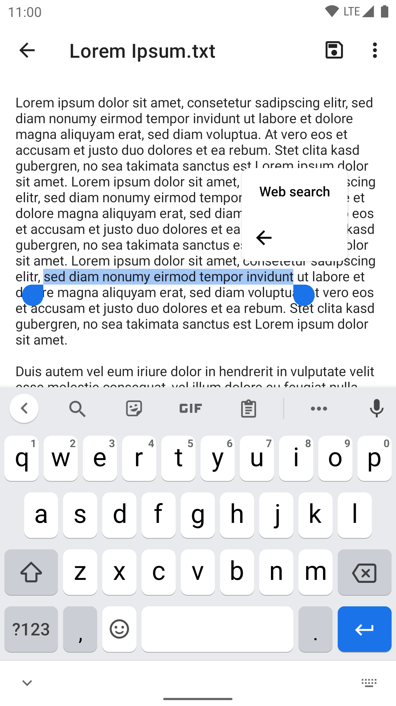
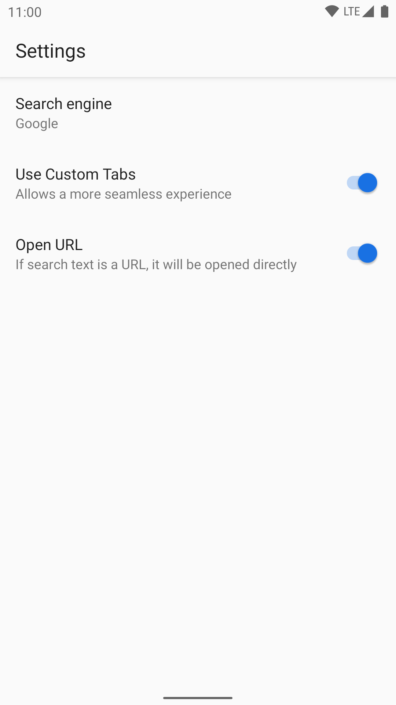
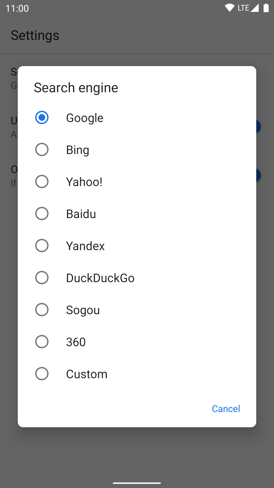

# alsonow-select(Select Text to Search)

## Add web search to text selection toolbar on Android. Forked in 2021 from zhanghai / TextSelectionWebSearch 

## not ready

  

This tiny app can add a "Web search" action to the text selection toolbar on Android.

It also adds a "Web search" as target for sharing text.

The default search engine can be configured in its settings page, openable in Custom Tabs toolbar, or the App info page for this app in system Settings.

Text selection toolbar requires Android 6.0 or above, so this app requires it as well.

## Preview

  

## License

    Copyright (C) 2021 samko5sam

    This program is free software: you can redistribute it and/or modify
    it under the terms of the GNU General Public License as published by
    the Free Software Foundation, either version 3 of the License, or
    (at your option) any later version.

    This program is distributed in the hope that it will be useful,
    but WITHOUT ANY WARRANTY; without even the implied warranty of
    MERCHANTABILITY or FITNESS FOR A PARTICULAR PURPOSE.  See the
    GNU General Public License for more details.

    You should have received a copy of the GNU General Public License
    along with this program.  If not, see <https://www.gnu.org/licenses/>.
